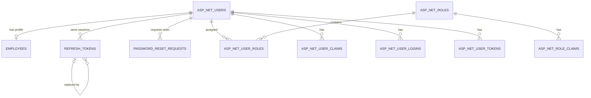

# HRManagement - Current Database Schema for ERD

## 1. Purpose

This document describes the PostgreSQL schema represented by the current EF Core model. It can be used as input for an Entity Relationship Diagram (ERD). It covers only implemented entities, not proposed future modules.

## 2. Database Overview

| Area | Tables |
|---|---|
| Human resources | `employees` |
| Authentication | `asp_net_users`, `asp_net_roles`, `asp_net_user_roles` |
| Extended Identity | `asp_net_user_claims`, `asp_net_role_claims`, `asp_net_user_logins`, `asp_net_user_tokens` |
| Session management | `refresh_tokens` |
| Password recovery | `password_reset_requests` |
| Auditing | `audit_logs` |
| EF Core | `__ef_migrations_history` |

The `employee_code_sequence` sequence generates employee codes such as `EMP001` and `EMP002`.

## 3. employees

Stores employee business profiles.

| Column | PostgreSQL type | Nullable | Key/constraint | Description |
|---|---|---:|---|---|
| `id` | uuid | No | PK | Employee ID |
| `employee_code` | varchar(20) | No | UNIQUE | Sequence-generated employee code |
| `first_name` | varchar(100) | No | | First name |
| `last_name` | varchar(100) | No | | Last name |
| `date_of_birth` | date | No | | Date of birth |
| `gender` | varchar(20) | No | | String representation of `Gender` |
| `phone_number` | varchar(20) | Yes | | Phone number |
| `address` | varchar(500) | Yes | | Address |
| `hire_date` | date | No | | Hire date |
| `status` | varchar(30) | No | | String representation of `EmployeeStatus` |
| `user_id` | uuid | Yes | FK, filtered UNIQUE | Linked login account |
| `created_at_utc` | timestamptz | No | | Creation time |
| `last_modified_by` | uuid | Yes | Logical reference | Last modifying user |
| `last_modified_at_utc` | timestamptz | Yes | | Last modification time |
| `is_deleted` | boolean | No | Default false | Soft-delete marker |
| `deleted_by` | uuid | Yes | Logical reference | User who soft-deleted the record |
| `deleted_at_utc` | timestamptz | Yes | | Soft-delete time |

Constraints and indexes:

- Primary key: `pk_employees (id)`.
- Unique index: `ix_employees_employee_code (employee_code)`.
- Filtered unique index: `ix_employees_user_id (user_id)` where `user_id IS NOT NULL AND NOT is_deleted`.
- Foreign key: `employees.user_id -> asp_net_users.id`.
- Deleting an AppUser sets `employees.user_id` to `NULL`.
- An EF Core global query filter hides rows where `is_deleted = true`.

## 4. asp_net_users

Stores login accounts managed by ASP.NET Core Identity and mapped to `AppUser`.

| Column | PostgreSQL type | Nullable | Key/constraint | Description |
|---|---|---:|---|---|
| `id` | uuid | No | PK | Account ID |
| `user_name` | varchar(256) | Yes | | User name |
| `normalized_user_name` | varchar(256) | Yes | UNIQUE | Normalized user name |
| `email` | varchar(256) | Yes | | Email address |
| `normalized_email` | varchar(256) | Yes | INDEX | Normalized email |
| `email_confirmed` | boolean | No | | Email confirmation flag |
| `password_hash` | text | Yes | | Identity password hash |
| `security_stamp` | text | Yes | | User security stamp |
| `concurrency_stamp` | text | Yes | Concurrency token | Optimistic concurrency value |
| `phone_number` | text | Yes | | Phone number |
| `phone_number_confirmed` | boolean | No | | Phone confirmation flag |
| `two_factor_enabled` | boolean | No | | Two-factor authentication flag |
| `lockout_end` | timestamptz | Yes | | Lockout expiration |
| `lockout_enabled` | boolean | No | | Whether lockout is enabled |
| `access_failed_count` | integer | No | | Failed login count |
| `created_at_utc` | timestamptz | No | | Account creation time |
| `is_active` | boolean | No | Default true | Whether the account may use the system |

Relationships:

- `asp_net_users 1 --- 0..1 employees`
- `asp_net_users 1 --- N refresh_tokens`
- `asp_net_users 1 --- N password_reset_requests`
- `asp_net_users N --- N asp_net_roles` through `asp_net_user_roles`
- One user may have many claims, external logins, and Identity tokens.

## 5. ASP.NET Core Identity Tables

### asp_net_roles

Stores authorization roles such as `ADMIN` and `USER`.

| Column | PostgreSQL type | Nullable | Key/constraint |
|---|---|---:|---|
| `id` | uuid | No | PK |
| `name` | varchar(256) | Yes | |
| `normalized_name` | varchar(256) | Yes | UNIQUE |
| `concurrency_stamp` | text | Yes | Concurrency token |

### asp_net_user_roles

Join table for the many-to-many relationship between users and roles.

| Column | PostgreSQL type | Nullable | Key/constraint |
|---|---|---:|---|
| `user_id` | uuid | No | PK, FK -> `asp_net_users.id` |
| `role_id` | uuid | No | PK, FK -> `asp_net_roles.id` |

The composite primary key is `(user_id, role_id)`. Both foreign keys use cascade delete.

### asp_net_user_claims

| Column | PostgreSQL type | Nullable | Key/constraint |
|---|---|---:|---|
| `id` | integer | No | PK, identity |
| `user_id` | uuid | No | FK -> `asp_net_users.id` |
| `claim_type` | text | Yes | |
| `claim_value` | text | Yes | |

### asp_net_role_claims

| Column | PostgreSQL type | Nullable | Key/constraint |
|---|---|---:|---|
| `id` | integer | No | PK, identity |
| `role_id` | uuid | No | FK -> `asp_net_roles.id` |
| `claim_type` | text | Yes | |
| `claim_value` | text | Yes | |

### asp_net_user_logins

Stores external-provider login details, such as Google or Microsoft login data.

| Column | PostgreSQL type | Nullable | Key/constraint |
|---|---|---:|---|
| `login_provider` | text | No | Composite PK |
| `provider_key` | text | No | Composite PK |
| `provider_display_name` | text | Yes | |
| `user_id` | uuid | No | FK -> `asp_net_users.id` |

### asp_net_user_tokens

Stores internal ASP.NET Core Identity tokens. This table is separate from the application's `refresh_tokens` table.

| Column | PostgreSQL type | Nullable | Key/constraint |
|---|---|---:|---|
| `user_id` | uuid | No | Composite PK, FK -> `asp_net_users.id` |
| `login_provider` | text | No | Composite PK |
| `name` | text | No | Composite PK |
| `value` | text | Yes | |

## 6. refresh_tokens

Stores hashed refresh tokens for session management and token revocation.

| Column | PostgreSQL type | Nullable | Key/constraint | Description |
|---|---|---:|---|---|
| `id` | uuid | No | PK | Refresh-token ID |
| `user_id` | uuid | No | FK | Token owner |
| `token_hash` | varchar(64) | No | UNIQUE | SHA-256 hash; the raw token is not stored |
| `expires_at_utc` | timestamptz | No | | Expiration time |
| `created_at_utc` | timestamptz | No | | Creation time |
| `revoked_at_utc` | timestamptz | Yes | | Revocation time |
| `replaced_by_token_id` | uuid | Yes | Self FK | Replacement token |

Deleting a user cascades to their refresh tokens. Deleting a referenced replacement token is restricted.

Example rotation chain:

```text
RefreshToken A (revoked) -> replaced by RefreshToken B
RefreshToken B (revoked) -> replaced by RefreshToken C
RefreshToken C (active)
```

## 7. password_reset_requests

Stores user password-reset requests and administrator processing status. It never stores old passwords, new passwords, or raw reset tokens.

| Column | PostgreSQL type | Nullable | Key/constraint | Description |
|---|---|---:|---|---|
| `id` | uuid | No | PK | Request ID |
| `user_id` | uuid | No | FK | Requesting user |
| `status` | varchar(20) | No | Filtered UNIQUE part | `Pending` or `Completed` |
| `completed_at_utc` | timestamptz | Yes | | Completion time |
| `completed_by` | uuid | Yes | Logical reference | Processing administrator |
| `created_at_utc` | timestamptz | No | | Request time |
| `last_modified_by` | uuid | Yes | Logical reference | Last modifying user |
| `last_modified_at_utc` | timestamptz | Yes | | Last modification time |
| `is_deleted` | boolean | No | | Soft-delete marker |
| `deleted_by` | uuid | Yes | Logical reference | Deleting user |
| `deleted_at_utc` | timestamptz | Yes | | Deletion time |

The user foreign key uses `ON DELETE RESTRICT`. A filtered unique index permits only one pending request per user. `completed_by` is a logical reference, not a physical foreign key.

## 8. audit_logs

Stores change history for entities derived from `BaseEntity`.

| Column | PostgreSQL type | Nullable | Key/constraint | Description |
|---|---|---:|---|---|
| `id` | uuid | No | PK | Audit-log ID |
| `table_name` | varchar(100) | No | INDEX part | Changed table |
| `record_id` | varchar(200) | No | INDEX part | Changed record ID |
| `action` | varchar(20) | No | | `Added`, `Modified`, or `Deleted` |
| `changed_columns` | jsonb | No | | Changed columns |
| `old_values` | jsonb | Yes | | Values before the change |
| `new_values` | jsonb | Yes | | Values after the change |
| `changed_by` | uuid | Yes | Logical reference | Acting user |
| `changed_by_email` | varchar(256) | Yes | | User email at change time |
| `changed_at_utc` | timestamptz | No | INDEX | Change time |

Audit logs intentionally have no physical foreign keys to users or business tables. This preserves history after source records are deleted.

## 9. __ef_migrations_history

EF Core uses this technical table to track applied migrations.

| Column | Description |
|---|---|
| `migration_id` | Applied migration ID |
| `product_version` | EF Core version that created the migration |

It has no business relationships and may be omitted from a business ERD.

## 10. Foreign-Key Summary

| Child table | FK column | Parent table | PK column | Cardinality | Delete behavior |
|---|---|---|---|---|---|
| `employees` | `user_id` | `asp_net_users` | `id` | User `1` - Employee `0..1` | SET NULL |
| `refresh_tokens` | `user_id` | `asp_net_users` | `id` | User `1` - RefreshToken `N` | CASCADE |
| `refresh_tokens` | `replaced_by_token_id` | `refresh_tokens` | `id` | Self reference | RESTRICT |
| `password_reset_requests` | `user_id` | `asp_net_users` | `id` | User `1` - ResetRequest `N` | RESTRICT |
| `asp_net_user_roles` | `user_id` | `asp_net_users` | `id` | User `1` - UserRole `N` | CASCADE |
| `asp_net_user_roles` | `role_id` | `asp_net_roles` | `id` | Role `1` - UserRole `N` | CASCADE |
| `asp_net_user_claims` | `user_id` | `asp_net_users` | `id` | User `1` - UserClaim `N` | CASCADE |
| `asp_net_role_claims` | `role_id` | `asp_net_roles` | `id` | Role `1` - RoleClaim `N` | CASCADE |
| `asp_net_user_logins` | `user_id` | `asp_net_users` | `id` | User `1` - UserLogin `N` | CASCADE |
| `asp_net_user_tokens` | `user_id` | `asp_net_users` | `id` | User `1` - UserToken `N` | CASCADE |

## 11. Relationship Summary

```text
asp_net_users 1 --- 0..1 employees
asp_net_users 1 --- N refresh_tokens
asp_net_users 1 --- N password_reset_requests
refresh_tokens 0..1 --- 0..N refresh_tokens : replaced_by_token_id

asp_net_users N --- N asp_net_roles through asp_net_user_roles
asp_net_users 1 --- N asp_net_user_claims
asp_net_users 1 --- N asp_net_user_logins
asp_net_users 1 --- N asp_net_user_tokens
asp_net_roles 1 --- N asp_net_role_claims

audit_logs --- no physical foreign keys
__ef_migrations_history --- no relationships
```

## 12. Reference Mermaid ERD



## 13. Suggested Diagram Prompt

```text
Using CURRENT_DATABASE_ERD.md, create a PostgreSQL ERD with Mermaid erDiagram.
Use only tables documented in the file.
Show primary keys, foreign keys, unique keys, nullable foreign keys, and cardinality.
Distinguish physical foreign keys from logical references in audit_logs.
Do not create foreign-key relationships for audit_logs or __ef_migrations_history.
```