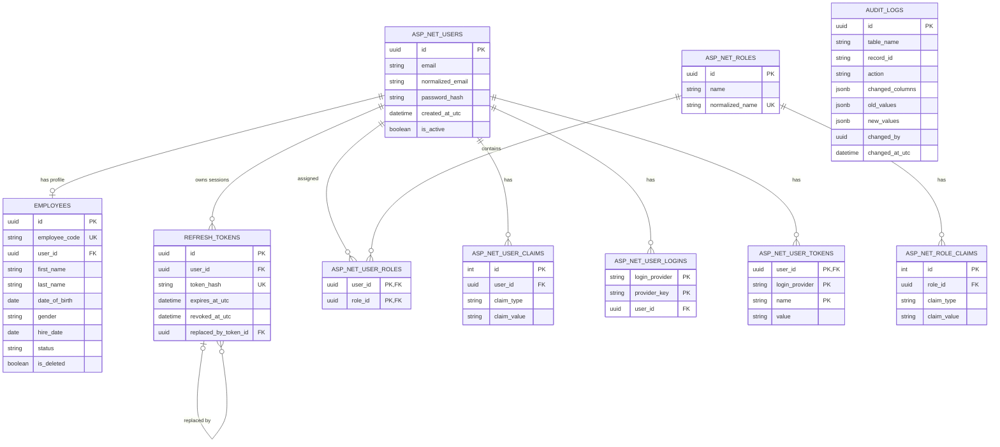

# HRManagement - Current Database Schema for ERD

## 1. Muc dich

Tai lieu nay mo ta cac bang dang ton tai trong PostgreSQL cua du an HRManagement. Noi dung duoc lay theo EF Core model hien tai va co the dung lam dau vao cho ChatGPT hoac cong cu tao Entity Relationship Diagram (ERD).

Tai lieu chi mo ta schema hien tai, khong bao gom cac entity du kien phat trien trong tuong lai.

## 2. Tong quan database

Database hien co cac nhom bang sau:

| Nhom | Bang |
|---|---|
| Nhan su | `employees` |
| Xac thuc | `asp_net_users`, `asp_net_roles`, `asp_net_user_roles` |
| Identity mo rong | `asp_net_user_claims`, `asp_net_role_claims`, `asp_net_user_logins`, `asp_net_user_tokens` |
| Quan ly phien | `refresh_tokens` |
| Audit | `audit_logs` |
| EF Core | `__ef_migrations_history` |

Ngoai cac bang, database co sequence `employee_code_sequence` de sinh ma nhan vien theo dinh dang `EMP001`, `EMP002`, ...

## 3. Bang employees

Luu ho so nghiep vu cua nhan vien.

| Cot | PostgreSQL type | Nullable | Key/constraint | Mo ta |
|---|---|---:|---|---|
| `id` | uuid | No | PK | ID nhan vien |
| `employee_code` | varchar(20) | No | UNIQUE | Ma nhan vien, tu sinh boi sequence |
| `first_name` | varchar(100) | No | | Ten |
| `last_name` | varchar(100) | No | | Ho |
| `date_of_birth` | date | No | | Ngay sinh |
| `gender` | varchar(20) | No | | Enum Gender duoc luu dang chuoi |
| `phone_number` | varchar(20) | Yes | | So dien thoai |
| `address` | varchar(500) | Yes | | Dia chi |
| `hire_date` | date | No | | Ngay vao lam |
| `status` | varchar(30) | No | | Enum EmployeeStatus duoc luu dang chuoi |
| `user_id` | uuid | Yes | FK, filtered UNIQUE | Tai khoan dang nhap lien ket |
| `created_at_utc` | timestamptz | No | | Thoi gian tao |
| `last_modified_by` | uuid | Yes | Logical reference | ID user cap nhat gan nhat |
| `last_modified_at_utc` | timestamptz | Yes | | Thoi gian cap nhat gan nhat |
| `is_deleted` | boolean | No | Default false | Co soft delete hay khong |
| `deleted_by` | uuid | Yes | Logical reference | ID user thuc hien soft delete |
| `deleted_at_utc` | timestamptz | Yes | | Thoi gian soft delete |

### Rang buoc va index

- Primary key: `pk_employees (id)`.
- Unique index: `ix_employees_employee_code (employee_code)`.
- Filtered unique index: `ix_employees_user_id (user_id)` voi dieu kien `user_id IS NOT NULL AND NOT is_deleted`.
- Foreign key: `employees.user_id -> asp_net_users.id`.
- Khi AppUser bi xoa, `employees.user_id` duoc gan `NULL` (`ON DELETE SET NULL`).
- Global query filter cua EF Core tu dong an cac ban ghi co `is_deleted = true`.

## 4. Bang asp_net_users

Luu tai khoan dang nhap. Bang nay duoc tao boi ASP.NET Core Identity va map voi entity `AppUser`.

| Cot | PostgreSQL type | Nullable | Key/constraint | Mo ta |
|---|---|---:|---|---|
| `id` | uuid | No | PK | ID tai khoan |
| `user_name` | varchar(256) | Yes | | Ten dang nhap |
| `normalized_user_name` | varchar(256) | Yes | UNIQUE | Ten dang nhap da chuan hoa |
| `email` | varchar(256) | Yes | | Email |
| `normalized_email` | varchar(256) | Yes | INDEX | Email da chuan hoa |
| `email_confirmed` | boolean | No | | Email da xac nhan |
| `password_hash` | text | Yes | | Mat khau da bam boi Identity |
| `security_stamp` | text | Yes | | Gia tri bao mat cua user |
| `concurrency_stamp` | text | Yes | Concurrency token | Kiem soat cap nhat dong thoi |
| `phone_number` | text | Yes | | So dien thoai |
| `phone_number_confirmed` | boolean | No | | So dien thoai da xac nhan |
| `two_factor_enabled` | boolean | No | | Bat xac thuc hai lop |
| `lockout_end` | timestamptz | Yes | | Thoi diem ket thuc khoa |
| `lockout_enabled` | boolean | No | | Cho phep khoa tai khoan |
| `access_failed_count` | integer | No | | So lan dang nhap that bai |
| `created_at_utc` | timestamptz | No | | Thoi gian tao tai khoan |
| `is_active` | boolean | No | Default true | Trang thai cho phep user su dung he thong |

Quan he:

- `asp_net_users 1 --- 0..1 employees`.
- `asp_net_users 1 --- N refresh_tokens`.
- `asp_net_users N --- N asp_net_roles` thong qua `asp_net_user_roles`.
- `asp_net_users 1 --- N asp_net_user_claims`.
- `asp_net_users 1 --- N asp_net_user_logins`.
- `asp_net_users 1 --- N asp_net_user_tokens`.

## 5. Bang asp_net_roles

Luu vai tro phan quyen, vi du `ADMIN` va `USER`.

| Cot | PostgreSQL type | Nullable | Key/constraint | Mo ta |
|---|---|---:|---|---|
| `id` | uuid | No | PK | ID role |
| `name` | varchar(256) | Yes | | Ten role |
| `normalized_name` | varchar(256) | Yes | UNIQUE | Ten role da chuan hoa |
| `concurrency_stamp` | text | Yes | Concurrency token | Kiem soat cap nhat dong thoi |

Quan he:

- `asp_net_roles N --- N asp_net_users` thong qua `asp_net_user_roles`.
- `asp_net_roles 1 --- N asp_net_role_claims`.

## 6. Bang asp_net_user_roles

Bang trung gian bieu dien quan he nhieu-nhieu giua user va role.

| Cot | PostgreSQL type | Nullable | Key/constraint |
|---|---|---:|---|
| `user_id` | uuid | No | PK, FK -> `asp_net_users.id` |
| `role_id` | uuid | No | PK, FK -> `asp_net_roles.id` |

Rang buoc:

- Composite primary key: `(user_id, role_id)`.
- Xoa user se cascade xoa cac dong user-role cua user.
- Xoa role se cascade xoa cac dong user-role cua role.

## 7. Bang asp_net_user_claims

Luu cac claim rieng gan truc tiep cho user.

| Cot | PostgreSQL type | Nullable | Key/constraint |
|---|---|---:|---|
| `id` | integer | No | PK, identity |
| `user_id` | uuid | No | FK -> `asp_net_users.id` |
| `claim_type` | text | Yes | |
| `claim_value` | text | Yes | |

Quan he: `asp_net_users 1 --- N asp_net_user_claims`, cascade delete.

## 8. Bang asp_net_role_claims

Luu cac claim gan cho role.

| Cot | PostgreSQL type | Nullable | Key/constraint |
|---|---|---:|---|
| `id` | integer | No | PK, identity |
| `role_id` | uuid | No | FK -> `asp_net_roles.id` |
| `claim_type` | text | Yes | |
| `claim_value` | text | Yes | |

Quan he: `asp_net_roles 1 --- N asp_net_role_claims`, cascade delete.

## 9. Bang asp_net_user_logins

Luu thong tin dang nhap tu nha cung cap ben ngoai nhu Google hoac Microsoft. Du an chua can su dung bang nay nhung ASP.NET Core Identity van tao san.

| Cot | PostgreSQL type | Nullable | Key/constraint |
|---|---|---:|---|
| `login_provider` | text | No | Composite PK |
| `provider_key` | text | No | Composite PK |
| `provider_display_name` | text | Yes | |
| `user_id` | uuid | No | FK -> `asp_net_users.id` |

Quan he: `asp_net_users 1 --- N asp_net_user_logins`, cascade delete.

## 10. Bang asp_net_user_tokens

Bang token noi bo cua ASP.NET Core Identity. Bang nay khac voi bang `refresh_tokens` do du an tu xay dung.

| Cot | PostgreSQL type | Nullable | Key/constraint |
|---|---|---:|---|
| `user_id` | uuid | No | Composite PK, FK -> `asp_net_users.id` |
| `login_provider` | text | No | Composite PK |
| `name` | text | No | Composite PK |
| `value` | text | Yes | |

Quan he: `asp_net_users 1 --- N asp_net_user_tokens`, cascade delete.

## 11. Bang refresh_tokens

Luu hash cua refresh token de quan ly phien dang nhap va thu hoi token.

| Cot | PostgreSQL type | Nullable | Key/constraint | Mo ta |
|---|---|---:|---|---|
| `id` | uuid | No | PK | ID refresh token |
| `user_id` | uuid | No | FK | Chu so huu token |
| `token_hash` | varchar(64) | No | UNIQUE | SHA-256 hash, khong luu token goc |
| `expires_at_utc` | timestamptz | No | | Thoi gian het han |
| `created_at_utc` | timestamptz | No | | Thoi gian tao |
| `revoked_at_utc` | timestamptz | Yes | | Thoi gian thu hoi |
| `replaced_by_token_id` | uuid | Yes | Self FK | Token moi thay the token nay |

Quan he:

- `asp_net_users 1 --- N refresh_tokens`.
- `refresh_tokens 0..1 --- 0..N refresh_tokens` qua `replaced_by_token_id`.
- Xoa user se cascade xoa tat ca refresh token cua user.
- Xoa token dang duoc token khac tham chieu bi gioi han boi `ON DELETE RESTRICT`.

Chuoi rotation vi du:

```text
RefreshToken A (revoked) -> replaced by RefreshToken B
RefreshToken B (revoked) -> replaced by RefreshToken C
RefreshToken C (active)
```

## 12. Bang audit_logs

Luu lich su thay doi cua cac entity ke thua `BaseEntity`.

| Cot | PostgreSQL type | Nullable | Key/constraint | Mo ta |
|---|---|---:|---|---|
| `id` | uuid | No | PK | ID audit log |
| `table_name` | varchar(100) | No | INDEX part | Ten bang bi thay doi |
| `record_id` | varchar(200) | No | INDEX part | ID ban ghi bi thay doi |
| `action` | varchar(20) | No | | Added, Modified hoac Deleted |
| `changed_columns` | jsonb | No | | Danh sach cot thay doi |
| `old_values` | jsonb | Yes | | Gia tri truoc thay doi |
| `new_values` | jsonb | Yes | | Gia tri sau thay doi |
| `changed_by` | uuid | Yes | Logical reference | ID user thuc hien |
| `changed_by_email` | varchar(256) | Yes | | Email user tai thoi diem thay doi |
| `changed_at_utc` | timestamptz | No | INDEX | Thoi gian thay doi |

`audit_logs` khong co foreign key vat ly den `asp_net_users` hoac bang nghiep vu. Day la chu y thiet ke de audit log van ton tai khi user hoac ban ghi goc da bi xoa. Khi tao ERD, co the ve duong net dut "logical reference" neu cong cu ho tro, nhung khong duoc danh dau la foreign key.

## 13. Bang __ef_migrations_history

Bang ky thuat do EF Core quan ly, dung de ghi nhan migration da ap dung.

| Cot | Mo ta |
|---|---|
| `migration_id` | ID migration da chay |
| `product_version` | Phien ban EF Core tao migration |

Bang nay khong co quan he voi cac bang nghiep vu va co the bo khoi ERD nghiep vu.

## 14. Tong hop foreign key

| Bang con | Cot FK | Bang cha | Cot PK | Cardinality | Delete behavior |
|---|---|---|---|---|---|
| `employees` | `user_id` | `asp_net_users` | `id` | User `1` - Employee `0..1` | SET NULL |
| `refresh_tokens` | `user_id` | `asp_net_users` | `id` | User `1` - RefreshToken `N` | CASCADE |
| `refresh_tokens` | `replaced_by_token_id` | `refresh_tokens` | `id` | Self reference | RESTRICT |
| `asp_net_user_roles` | `user_id` | `asp_net_users` | `id` | User `1` - UserRole `N` | CASCADE |
| `asp_net_user_roles` | `role_id` | `asp_net_roles` | `id` | Role `1` - UserRole `N` | CASCADE |
| `asp_net_user_claims` | `user_id` | `asp_net_users` | `id` | User `1` - UserClaim `N` | CASCADE |
| `asp_net_role_claims` | `role_id` | `asp_net_roles` | `id` | Role `1` - RoleClaim `N` | CASCADE |
| `asp_net_user_logins` | `user_id` | `asp_net_users` | `id` | User `1` - UserLogin `N` | CASCADE |
| `asp_net_user_tokens` | `user_id` | `asp_net_users` | `id` | User `1` - UserToken `N` | CASCADE |

## 15. Quan he ngan gon cho cong cu tao ERD

```text
asp_net_users 1 --- 0..1 employees
asp_net_users 1 --- N refresh_tokens
refresh_tokens 0..1 --- 0..N refresh_tokens : replaced_by_token_id

asp_net_users N --- N asp_net_roles through asp_net_user_roles
asp_net_users 1 --- N asp_net_user_claims
asp_net_users 1 --- N asp_net_user_logins
asp_net_users 1 --- N asp_net_user_tokens
asp_net_roles 1 --- N asp_net_role_claims

audit_logs --- no physical foreign keys
__ef_migrations_history --- no relationships
```

## 16. Mermaid ERD tham khao

Khoi Mermaid nay the hien cac bang va quan he chinh. Co the dua nguyen noi dung tai lieu cho ChatGPT de bo sung day du cot vao diagram.



## 17. Prompt de xuat de tao diagram

```text
Dua tren tai lieu CURRENT_DATABASE_ERD.md, hay tao ERD cho PostgreSQL bang Mermaid erDiagram.
Chi su dung cac bang hien co trong tai lieu.
Hien thi PK, FK, unique key, nullable foreign key va cardinality.
Phan biet foreign key vat ly voi logical reference trong audit_logs.
Khong tao quan he foreign key cho audit_logs va __ef_migrations_history.
```
